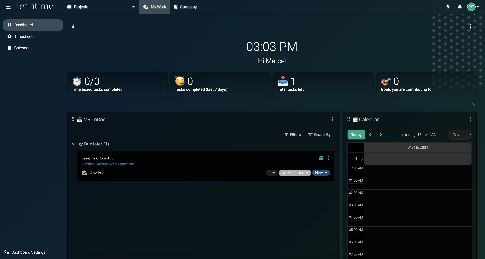
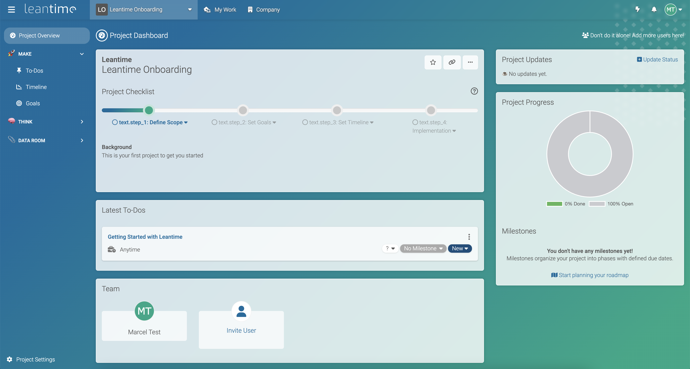
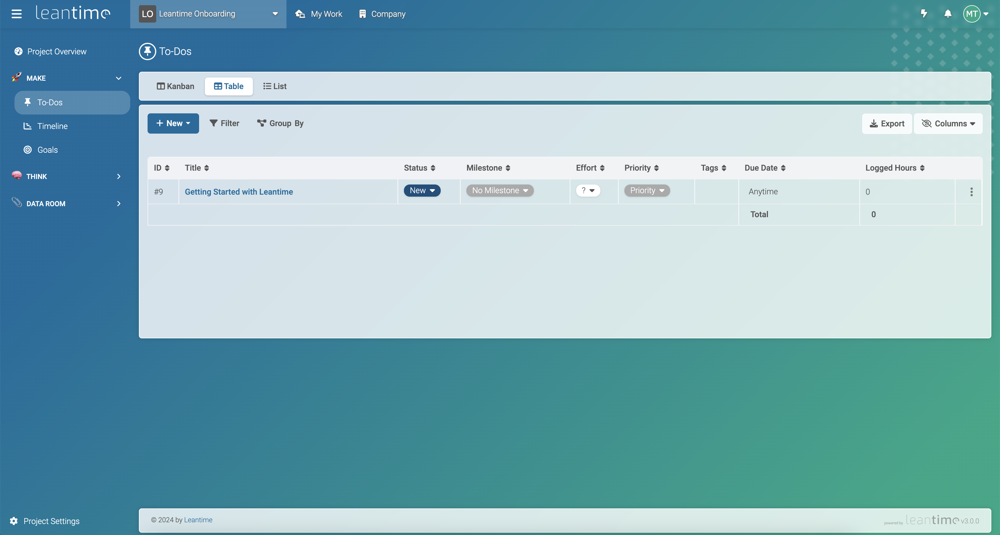
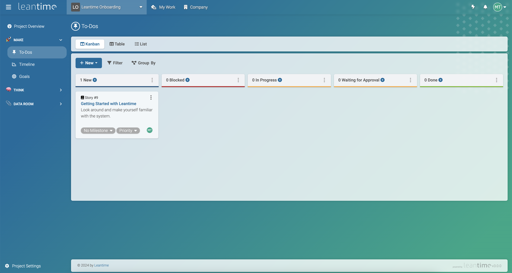
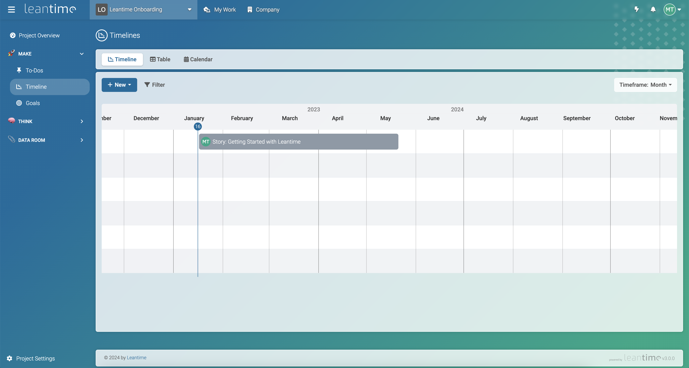
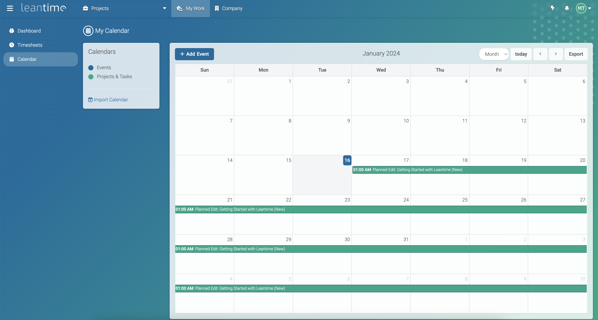
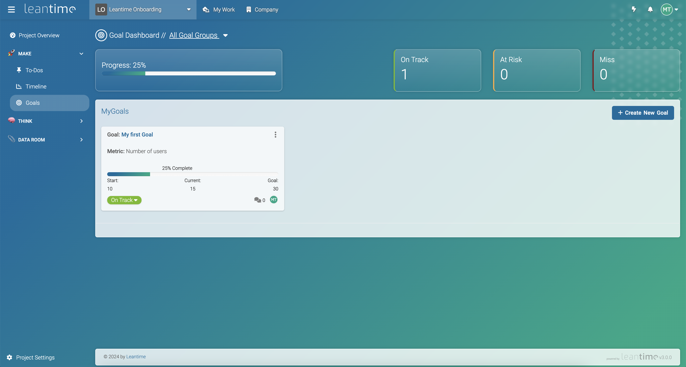
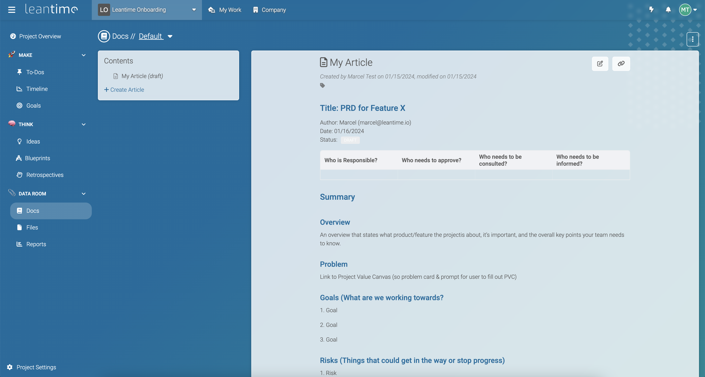
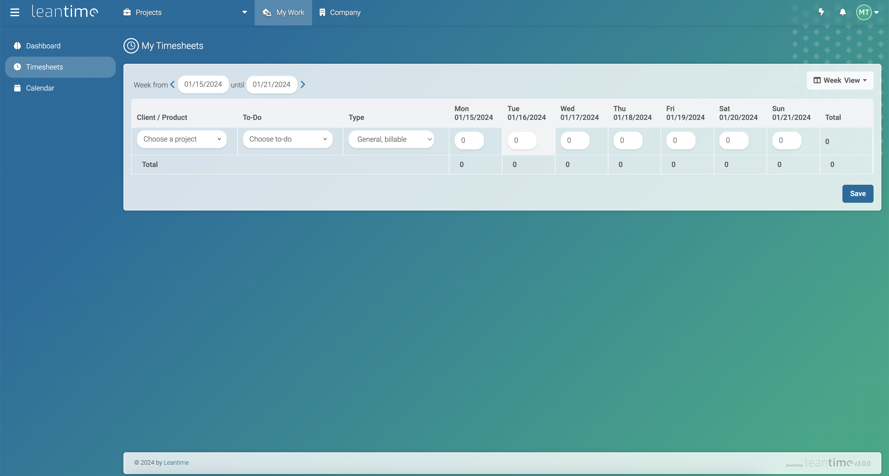

<div align="center">
<a href="https://leantime.io"></a>

# Leantime&reg; 

⭐ If you find Leantime useful, please star us on GitHub! ⭐

Leantime is an open source project management system for non-project managers.<br />
We combine strategy, planning and execution while making it easy for everyone on the team to use.<br />
Built with ADHD, dyslexia and autism in mind. 🧠<br />

💪 As simple as Trello but as feature-rich as Jira<br />
🔄 A perfect alternative to ClickUp, Monday, or Asana<br />
🌐 [https://leantime.io](https://leantime.io)<br />

<a href="https://trendshift.io/repositories/2264" target="_blank"></a>

[](https://www.gnu.org/licenses/agpl-3.0.en.html)
[](https://hub.docker.com/r/leantime/leantime)

[](https://discord.gg/4zMzJtAq9z)
[](https://crowdin.com/project/leantime)

<br />

  

</div>
<br /><br />

## 🚀 Features* ##
| Task Management                                                      | Project Planning                             | Information/Knowledge Management        | Administration                                  |
| -------------------------------------------------------------------- | -------------------------------------------- | --------------------------------------- |-------------------------------------------------|
| Task management via<br>kanban boards, gantt, table, list and calendar views | Project Dashboards, reports & status updates | Wikis / Docs                     | Easy installation                               |
| Unlimited subtasks and dependencies                                  | Goal & metrics tracking                      | Idea Boards                             | Multiple user roles and per project permissions |
| Milestone management                                                 | Lean & Business Model Canvas                 | Retrospectives                          | Two factor authentication                       |
| Sprint Management                                                    | SWOT Analysis canvas                         | File Storage via S3 or local filesystem | LDAP, OIDC integration                          |
| Timetracking & timesheets                                            | Risk Analysis                                | Screen & webcam recording               | Extendable via plugins and API                  |
|                                                                      | ... and more                                 | Comments/discussions on everything      | Integrates with Slack, Mattermost, Discord      |
|                                                                      | ... and more                                 |     | Available in over 20 languages                  |     
*yes, all of these features are included in the OSS version
<br /><br />
### 📸 Screenshots ###

<table width="100%">
    <tr>
        <td width="33%"></td>
        <td width="33%"></td>
        <td width="33%"></td>
    </tr>
    <tr>
        <td></td>
        <td></td>
        <td></td>
    </tr>
    <tr>
        <td></td>
        <td></td>
        <td></td>
    </tr>
</table>

<br /><br />
### ❗System Requirements ###

* PHP 8.2+
* MySQL 8.0+ or MariaDB 10.6+
* Apache or Nginx (IIS works with some modifications)
* PHP Extensions:
* BC Math (bcmath)
* Ctype
* cURL
* DOM
* Exif
* Fileinfo
* Filter
* GD
* Hash
* LDAP
* Multibyte String (mbstring)
* MySQL
* OPcache
* OpenSSL
* PCNTL
* PCRE
* PDO
* Phar
* Session
* Tokenizer
* Zip
* SimpleXML
<br /><br />

### ️⚡️ Installation (Production) ###

There are two main ways to install LeanTime for production. The first of which is to install all needed pieces of the system locally. The second is to use the officially supported Docker image.

#### Local Production Installation ####

* Download latest release package (file is called: Leantime-vx.x.x.zip) from the <a href="https://github.com/Leantime/leantime/releases">release page</a>
* Create an empty MySQL database
* Upload the entire directory to your server 
* Point your domain root to the `public/` directory
* Rename `config/sample.env` to `config/.env`
* Fill in your database credentials (username, password, host, dbname) in `config/.env`
* Navigate to `<yourdomain.com>/install`
* Follow instructions to install database and set up first user account

##### IIS Installation Notes #####

Whilst the steps above are applicable to Internet Information Services (IIS), there is an additional configuration change that may be required in IIS to ensure full functionality - you need to allow the PATCH method:

* Open IIS
* Expand the server and sites on the left and select the LeanTime site
* Double click on `Handler Mappings`
* Double click on the PHP handler mapping that is used by the site
* Click `Request Restrictions…`
* Click the `Verbs` tab
* In the `One of the following verbs` text box, add `PATCH` - for example: `GET,HEAD,POST,PATCH`
* Click `OK`
* In the `Executable (optional)` text box, put a double quote character (`“`) at the start and at the end of the path to the `php-cgi.exe` file (_this isn't needed if the path doesn't have a space in it_)
* Click `OK`
* A popup will appear asking if you want to create a FastCGI application - click `Yes`

Note: You may need to repeat this when you upgrade PHP.

#### Production Installation via Docker ####

We maintain an official <a href="https://hub.docker.com/r/leantime/leantime">Docker image on dockerhub</a>. 
To run the image enter your MySQL credentials and execute. You can pass in all the configuration variables from .env

```
docker run -d --restart unless-stopped -p 8080:8080 --network leantime-net \
-e LEAN_DB_HOST=mysql_leantime \
-e LEAN_DB_USER=admin \
-e LEAN_DB_PASSWORD=321.qwerty \
-e LEAN_DB_DATABASE=leantime \
-e LEAN_EMAIL_RETURN=changeme@local.local \
--name leantime leantime/leantime:latest
```

Unless you have a database defined somewhere else you should use our [docker-compose file](https://github.com/Leantime/docker-leantime/blob/master/docker-compose.yml). 

Once started you can go to `<yourdomain.com>/install` and run the installation script.

**Important: If you are planning to use plugins you need to mount the plugin folder `plugins:/var/www/html/app/Plugins` and ensure the www-data user has access to it. Otherwise installation may fail or plugins will be removed after a restart**

##### Docker Installation Notes #####

If you intend to place Leantime behind a reverse proxy (nginx, etc.) to handle custom domain name resolution and SSL offloading, you will need to set the following environment variable in docker
```
-e LEAN_APP_URL=https://yourdomain.com \
```
* Update yourdomain.com to your custom domain name.
<br /><br />
### 🤓 Installation (Development) ###

There are two ways to install a development setup of LeanTime. The first (but most technical) is to install all pieces of the system locally. The second (and preferred method) is to use a docker containerized development environment.

#### Local Development Installation ####

* Clone repository to your local server
* Create MySQL database
* Run webpack builder via `make build-dev`
* Point your local domain to the `public/` directory
* Rename `config/sample.env` to `config/.env`
* Fill in your database credentials (username, password, host, dbname) in `config/.env`
* Navigate to `<localdomain>/install`
* Follow instructions to install database and user account

#### Development Installation via Docker ####

For development, we use a dockerized development environment. You will need to have ``docker``, ``docker compose``, ``make``, ``composer``, ``git`` and ``npm`` installed.

* Notes for Windows Environments:
    - Run all commands within the git bash terminal in order to utilize unix specific commands
    - If installing php from a zip file, make sure to configure php.ini
    It does not exist initially, so copy C:\php\php.ini-development to C:\php\php.ini. You will also need to edit php.ini in a text editor and enable all needed extensions for the build process. You can find these by running the make commands and looking for any extensions that error out as missing. You can enable them by searching php.ini for the extension that will look like: `;extension=gd` and removing the semicolon. 

In order to build the development docker image, in the root of this repository, run a primer with

```make clean build```

afterwards, run 

```make run-dev```

this will start the development server on port 5080.

The dev environment provides a MySQL server, mail server, s3 server, and should be good to go for your needs out of the box. The basic configuration of the development environment is already defined in the composer file. You can create .env file inside of `config/.env` to augment the base configuration by setting some of the configs out of sample.env). **Important: Don't update the database information as this will disconnect the app from the docker database**. The applications you get are as follows

* [http://localhost:8090](http://localhost:5080) : leantime
* [http://localhost:8081](http://localhost:8081) : maildev - to check emails sent
* [http://localhost:8082](http://localhost:8082) : phpMyAdmin(authentication ``leantime:leantime``) to check the DB schema and data
* [http://localhost:8083](http://localhost:8083) : s3ninja - to check s3 uploads. You need to enable this in the ``.dev/.env`` file by enabling s3

Additionally, Xdebug is enabled, but you will have to modify your 
IDE key in the ``.dev/xdebug.ini`` file(or alternatively, on your IDE). You also need to have port 9003 temporarily open on your firewall so you can utilize it effectively. This is because connections from docker to the host will count as external inbound connections
<br /><br />

### Run Tests

Static Analysis `make phpstan`<br />
Code Style `make test-code-style` (to fix code style automatically use `make fix-code-style`)<br />
Unit Tests `make unit-test`<br />
Acceptance Tests `make acceptance-test`<br /> (requires docker)

You can test individual acceptance test groups directly using:<br />
For api: <br />
`docker compose --file .dev/docker-compose.yaml --file .dev/docker-compose.tests.yaml exec leantime-dev php vendor/bin/codecept run -g api --steps`<br />
For timesheets: <br />
`docker compose --file .dev/docker-compose.yaml --file .dev/docker-compose.tests.yaml exec leantime-dev php vendor/bin/codecept run -g timesheet --steps`<br />


### Local Testing on a Clean Ubuntu Server ###

If you're spinning up a fresh Ubuntu VM (e.g. on DigitalOcean, AWS, etc.) to test, follow these steps:

#### 1. Install dependencies

```bash
sudo apt update
sudo apt install -y ca-certificates curl gnupg git make
```

#### 2. Install Docker

```bash
sudo install -m 0755 -d /etc/apt/keyrings
curl -fsSL https://download.docker.com/linux/ubuntu/gpg | sudo gpg --dearmor -o /etc/apt/keyrings/docker.gpg
sudo chmod a+r /etc/apt/keyrings/docker.gpg

echo "deb [arch=$(dpkg --print-architecture) signed-by=/etc/apt/keyrings/docker.gpg] https://download.docker.com/linux/ubuntu \
$(. /etc/os-release && echo "$VERSION_CODENAME") stable" | sudo tee /etc/apt/sources.list.d/docker.list > /dev/null

sudo apt update
sudo apt install -y docker-ce docker-ce-cli containerd.io docker-buildx-plugin docker-compose-plugin
sudo usermod -aG docker $USER
newgrp docker
```

#### 3. Install Node.js, PHP, and Composer

```bash
# Node.js
curl -fsSL https://deb.nodesource.com/setup_20.x | sudo -E bash -
sudo apt install -y nodejs

# PHP + required extensions
sudo apt install -y php-cli php-xml php-curl php-mbstring php-zip php-ldap php-mysql php-bcmath php-gd unzip

# Composer
curl -sS https://getcomposer.org/installer | php
sudo mv composer.phar /usr/local/bin/composer
```

#### 4. Clone and build

```bash
git clone https://github.com/TechHutTV/leantime.git
cd leantime
make clean build
```

#### 5. Start the dev environment

```bash
make run-dev
```

#### 6. Fix storage directories (if you get a 500 error)

The storage directories may not exist inside the container. Run:

```bash
docker exec leantime-dev mkdir -p /var/www/html/storage/logs /var/www/html/storage/framework/cache /var/www/html/storage/framework/sessions /var/www/html/storage/framework/views
docker exec leantime-dev chown -R www-data:www-data /var/www/html/storage
```

#### 7. Fix Apache AllowOverride (if you still get a 500 error)

If `.htaccess` rewrites aren't working, enable them:

```bash
docker exec leantime-dev sed -i 's/AllowOverride None/AllowOverride All/g' /etc/apache2/apache2.conf
docker exec leantime-dev apache2ctl restart
```

#### 8. Access the app

Open `http://<your-server-ip>:5080` in your browser. Make sure port 5080 is open in your firewall/security group.

Other services:
- MailDev (email testing): check `docker ps` for the mapped port
- phpMyAdmin: check `docker ps` for the mapped port (auth: `leantime:leantime`)
- S3Ninja: check `docker ps` for the mapped port

<br /><br />

###  🏗 Update ###

#### Manual
* Make sure to take a backup of your database and files
* Replace all files in your directory with the updated version
* If there were any database changes, the system will redirect you to `<yourdomain.com>/update`

#### CLI
* Run `php bin/leantime system:update` 

#### Docker
* Before updating, make sure your mysql container was started using a mounted volume, otherwise your content will be deleted
* Delete/Stop existing container
* Pull the latest docker image and rebuild using your compose file 


### Common Issues

Please refer to our [documentation](https://docs.leantime.io/installation/common-issues) about common issues found when installing or updating Leantime 

## 🔌 Extend Leantime ##

#### You can extend Leantime by:
- building your own plugin: [Plugin Docs](https://docs.leantime.io/development/plugin-development)
- using our json-rpc API: [API Docs](https://docs.leantime.io/api/usage)
- or by purchasing a plugin from our [marketplace](https://marketplace.leantime.io)


## 🛟 Let us install it for you. ##

Hassle free installation service in your environments. We can do full installations, updates, configurations or plugin installations. See our [Marketplace](https://marketplace.leantime.io/product-category/services/technical/) for details.<br/><br/>

## ☁️ Not interested in hosting yourself? Let us do it for you ##

We offer [managed hosting plans](https://leantime.io/managed-hosting/) as well as a [SaaS product](https://leantime.io/pricing/) so you can get all the benefits of Leantime without the hassle.
Head to [leantime.io](https://leantime.io/) for more information.
<br /><br />

## 🤙 Need technical support? ##

We can help you set up Leantime in your environment and customize it to your needs. Our support plans are [outlined on our website](https://leantime.io/priority-support/).

Please note: We currently only support the official Leantime docker compose and standard installations. 
We only offer support for the most recent version. 

We do not offer support for Cloudron, Elestio, Turnkey, or other external distribution platforms sharing unofficial versions of Leantime. 

## 🫴 Contributing

We're excited you are interested in contributing to Leantime. We want to make sure you have a great experience contributing to Leantime and that the new features you build will make it into core. 
<br />

### 🪲 Bugs

Find an issue on Github (or create a new one) add your name to it or comment that you will be working on it. Once fixed, create a  Pull Request.

### New Features in Core

If you have an idea about new features please reach out to us on Discord. This is where we coordinate feature development and discuss whether core is the right place to add your new features (Plugins is the alternative). 

### 🌏 Translations

Language files and translations are stored in `app/Language/* `. Once updates please create a Pull Request. 

### 👥 Community Support

* Documentation [https://docs.leantime.io](https://docs.leantime.io)
* Community Chat [Discord](https://discord.gg/4zMzJtAq9z)
* File a bug report [https://github.com/Leantime/leantime/issues/new](https://github.com/Leantime/leantime/issues/new)
* Translations [https://crowdin.com/project/leantime](https://crowdin.com/project/leantime)
<br /><br />
## ⚖️ LICENSE Exceptions

Leantime is licensed under AGPLv3.
This file forms part of the Leantime Software for which the following exception is added: Plugins within the `/app/Plugins` directory which may contain plugins licensed under other licenses including our enterprise license.


