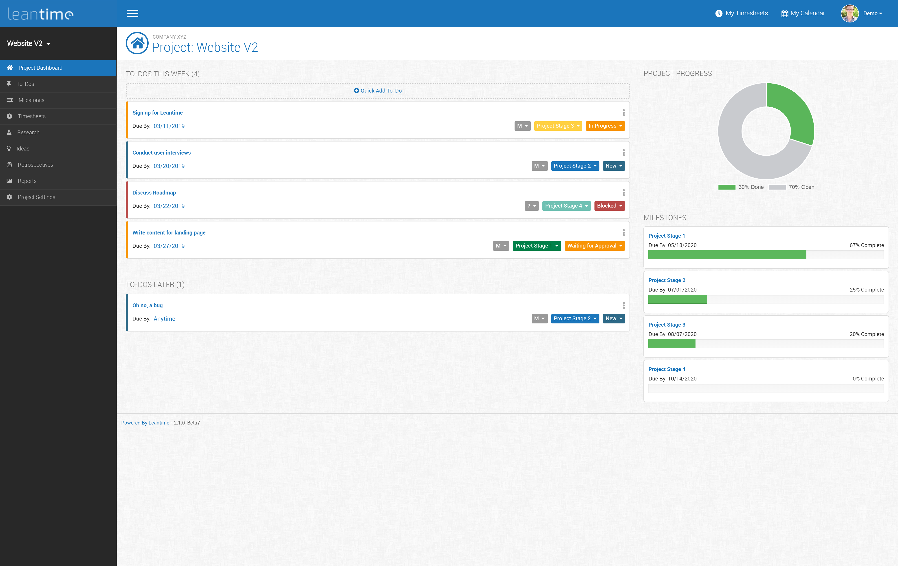
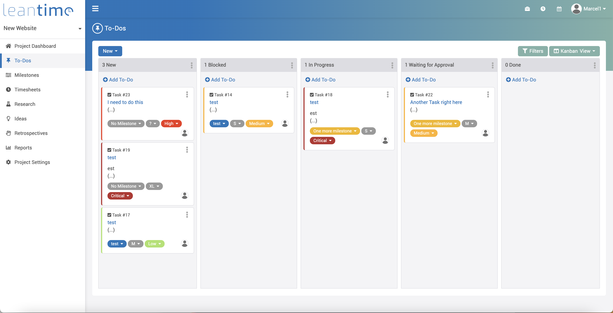
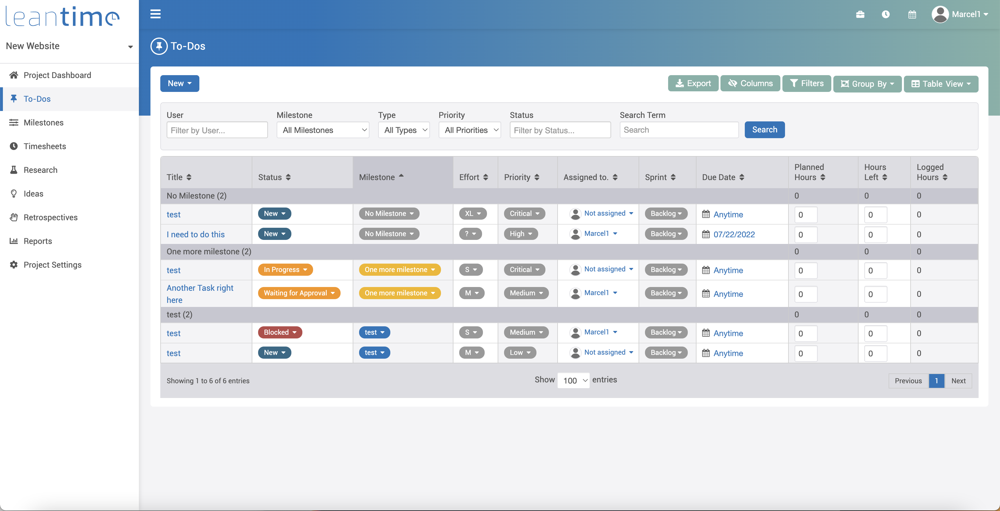
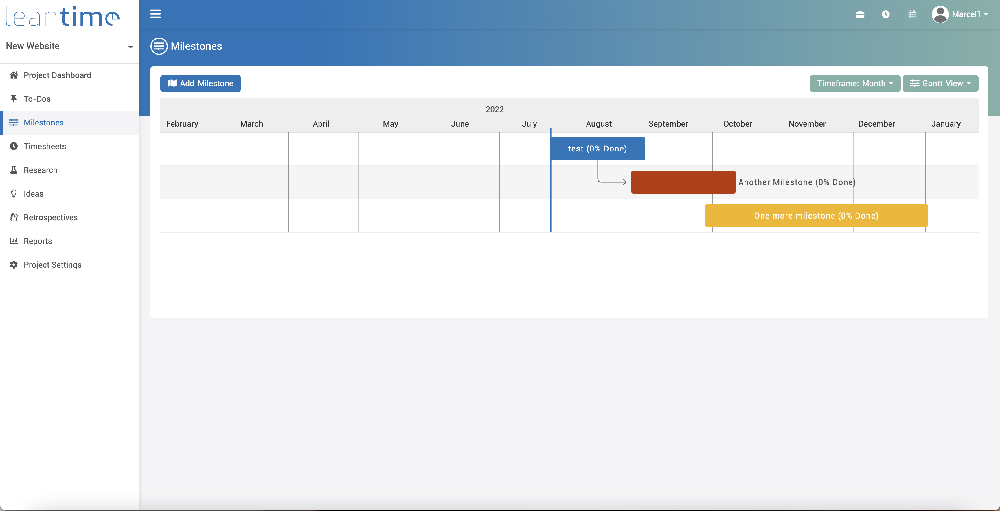
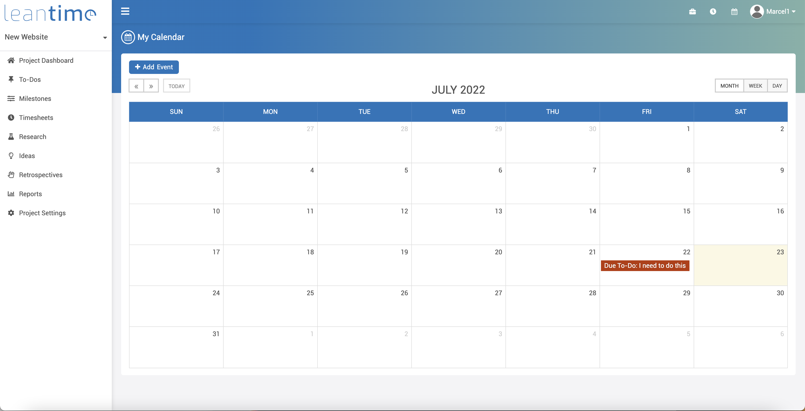
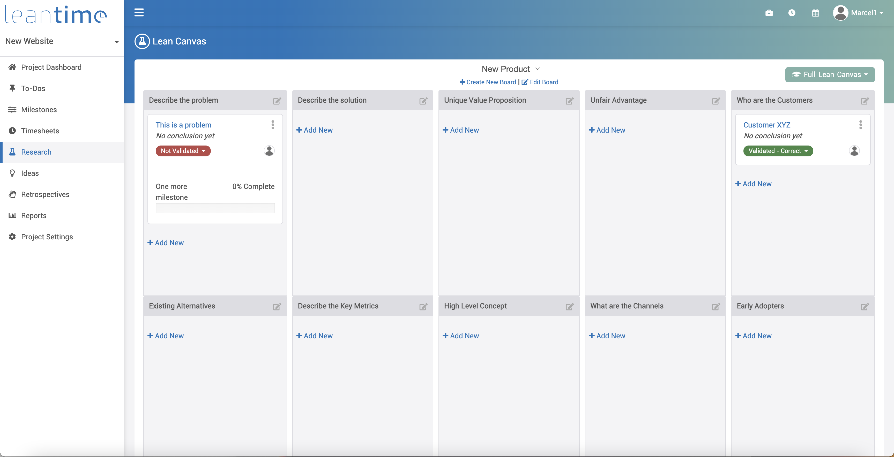
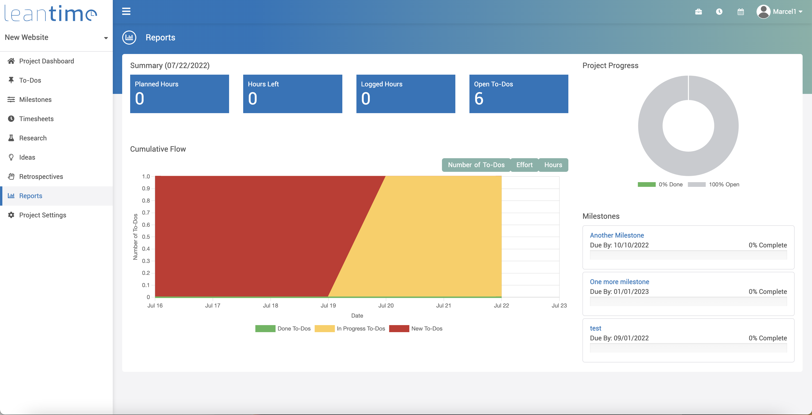

# Leantime&trade; #

[](https://www.gnu.org/licenses/old-licenses/gpl-2.0.html)
[](https://github.com/Leantime/leantime/releases)
[](https://hub.docker.com/r/leantime/leantime)
[](https://discord.gg/4zMzJtAq9z)

<br />

Leantime is a lean open source project management system for startups and innovators written in PHP, Javascript with MySQL. [https://leantime.io](https://leantime.io)
<br /><br />

Features:
* Task management using kanban boards, table and calendar views
* Idea boards & idea kanban boards
* Research boards using the Lean Canvas
* Milestone management using Gantt charts
* Timesheet management
* Retrospectives
* Project dashboards
* Project reports
* Multiple user roles (client, team member, client manager, manager, administrator)
* Two-Factor Authentication
* LDAP integration
* Integrations with Mattermost, Slack, Zulip, Discord
* Export timesheets, tasks and milestones to CSV
* File storage with AWS S3 or local file system 
* Available in English, Spanish, Russian, Dutch, German, French, Hebrew, Japanese, Portuguese (Brazil), Vietnamese (Viet Nam), Chinese (S), Chinese (T), Japanese


### Screenshots ###

|     |  |  |
|---------------------------------------------------------------------|:--------------------------------------------------------------------:|:---------------------------------------------------------------------:|
|  |  |          |
|       |     |                                                                       |

### System Requirements ###

* PHP 8+
* MySQL 5.7+
* Apache or Nginx (IIS works with some modifications)

### Installation (Production) ###

* Download latest release package
* Create an empty MySQL database
* Upload entire directory to your server 
* Point your domain to the `public/` directory
* Rename `config/configuration.sample.php` to `config/configuration.php`
* Fill in your database credentials (username, password, host, dbname) in `config/configuration.php`
* Navigate to `<yourdomain.com>/install`
* Follow instructions to install database and set up first user account

### Installation (Development) ###

* Install composer and npm
* Clone repository to your local server
* Create MySQL database
* Run composer to load php dependencies
```
composer install
```
then
```
npm install
```
to load Javascript dependencies and finally run the grunt task to create the compiled js files
```
./node_modules/grunt/bin/grunt Build-All
```
* Point your local domain to the `public/` directory
* Rename `config/configuration.sample.php` to `config/configuration.php`
* Fill in your database credentials (username, password, host, dbname) in `config/configuration.php`
* Navigate to `<localdomain>/install`
* Follow instructions to install database and user account

### Installation via Docker ###

We maintain an official <a href="https://hub.docker.com/r/leantime/leantime">Docker image on dockerhub</a>. 
To run the image enter your MySQL credentials and execute

```
docker run -d --restart unless-stopped -p 80:80 --network leantime-net \
-e LEAN_DB_HOST=mysql_leantime \
-e LEAN_DB_USER=admin \
-e LEAN_DB_PASSWORD=321.qwerty \
-e LEAN_DB_DATABASE=leantime \
-e LEAN_EMAIL_RETURN=changeme@local.local \
--name leantime leantime/leantime:latest
```

You can set any of the config variables in `config/configuration.php` when running the docker command.

Once started you can go to `<yourdomain.com>/install` and run the installation script.

### Update ###

* Make sure to take a backup of your database and files
* Replace all files in your directory with the updated version
* If there were any database changes, the system will redirect your to `<yourdomain.com>/update`

### Support ###
* Documentation [https://docs.leantime.io](https://docs.leantime.io)
* Community Forum [https://community.leantime.io](https://community.leantime.io)
* Discussions on [Discord](https://discord.gg/4zMzJtAq9z)
* File a bug report [https://github.com/Leantime/leantime/issues/new](https://github.com/Leantime/leantime/issues/new)
