<div align="center">
<a href="https://leantime.io"></a>

### Leantime&reg; ###

Leantime is an open source project management system for non-project manager.<br />We combine strategy, planning and executing while making it easy for everyone on the team to use.<br />It's an alternative to ClickUp, Monday, or Asana. As simple as Trello but as feature rich as Jira.<br />[https://leantime.io](https://leantime.io)<br />

[](https://www.gnu.org/licenses/agpl-3.0.en.html)
[](https://hub.docker.com/r/leantime/leantime)

[](https://discord.gg/4zMzJtAq9z)
[](https://crowdin.com/project/leantime)

<br />

  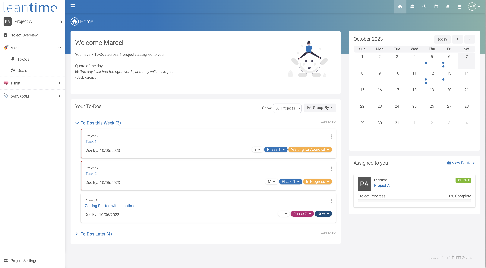

</div>
<br /><br />

## 🚀 Features* ##
| Task Management                                                      | Project Planning                             | Information/Knowledge Management        | Administration                                                           |
| -------------------------------------------------------------------- | -------------------------------------------- | --------------------------------------- | ------------------------------------------------------------------------ |
| Task management via<br>kanban boards, table, list and calendar views | Project Dashboards, reports & status updates | Wikis / Docs                            | Easy installation                                                        |
| Unlimited subtasks and dependencies                                  | Goal & metrics tracking                      | Idea Boards                             | Multiple user roles and per project permissions                          |
| Milestone management                                                 | Lean & Business Model Canvas                 | Retrospectives                          | Two factor authentication                                                |
| Sprint Management                                                    | SWOT Analysis canvas                         | File Storage via S3 or local filesystem | LDAP, OIDC integration                                                   |
| Timetracking & timesheets                                            | Risk Analysis                                | Screen & webcam recording               | Integration with mattermost, slack, discord and zulip (more coming soon) |
|                                                                      | ... and more                                 | Comments/discussions on everything      | Available in 19 languages                                                |

*yes, all of theses features are included in the OSS version
<br /><br />
### 📸 Screenshots ###

| 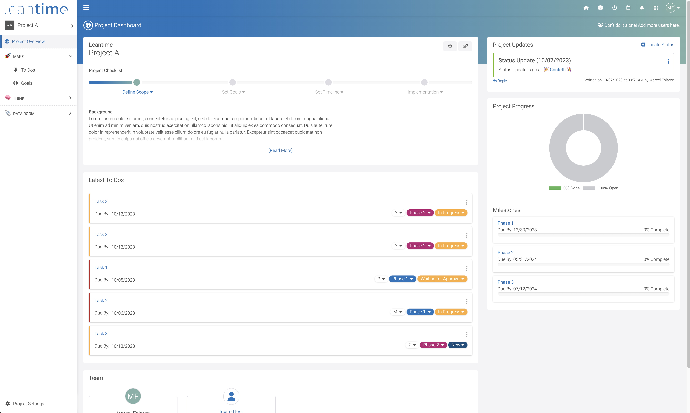 |       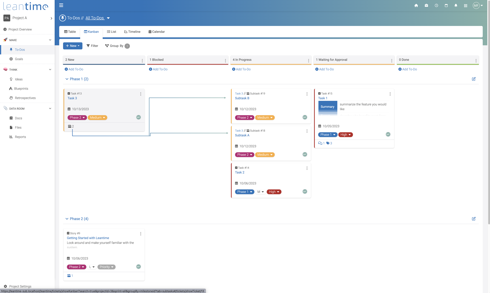       |   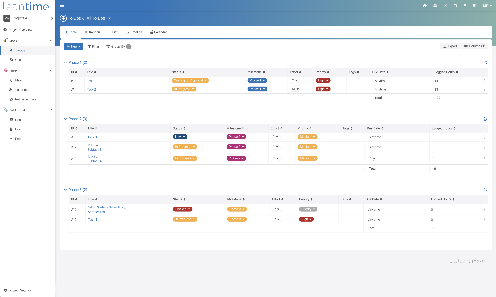    |
|----------------------------------------------------------------------------------------|:------------------------------------------------------------------------------------:|:-----------------------------------------------------------------------------------:|
| 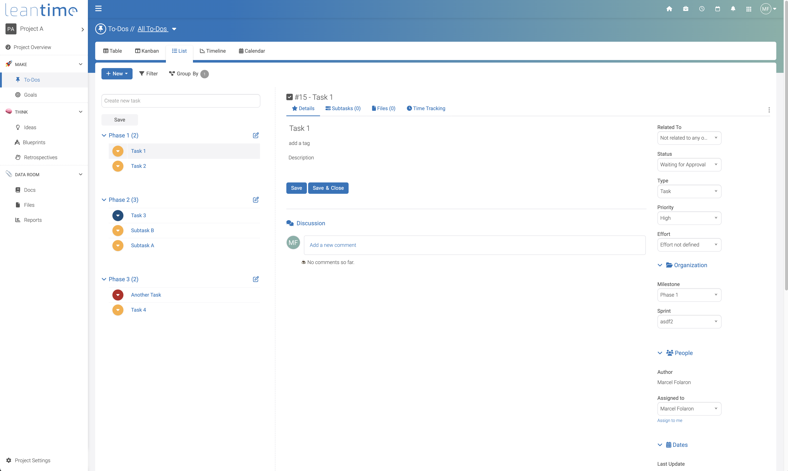              | 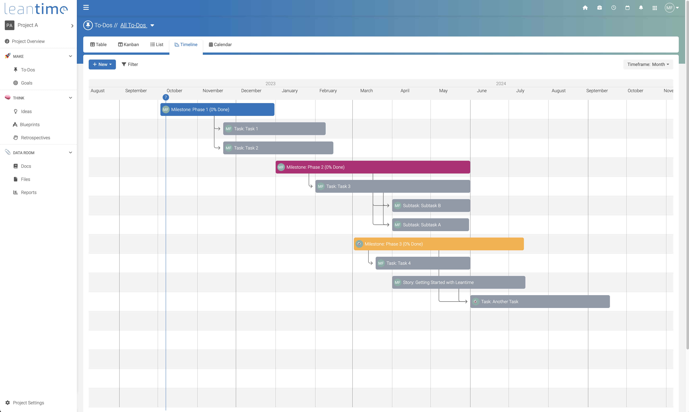 |  |
| 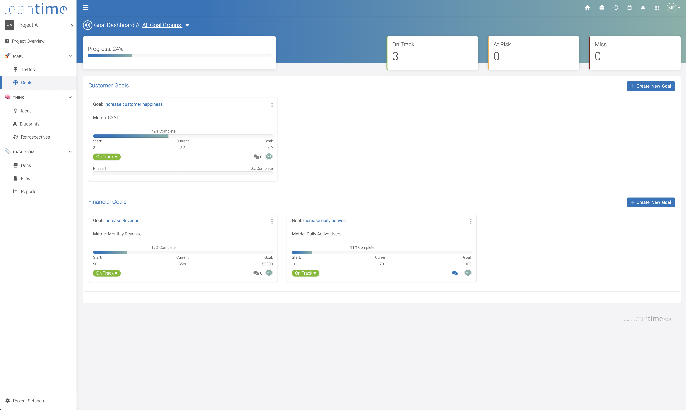                        |            |     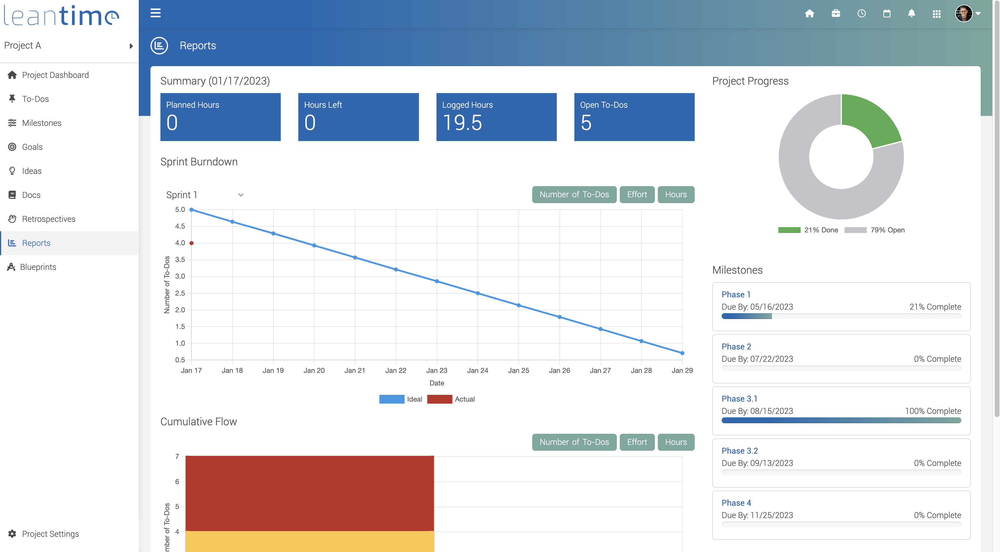      |
| 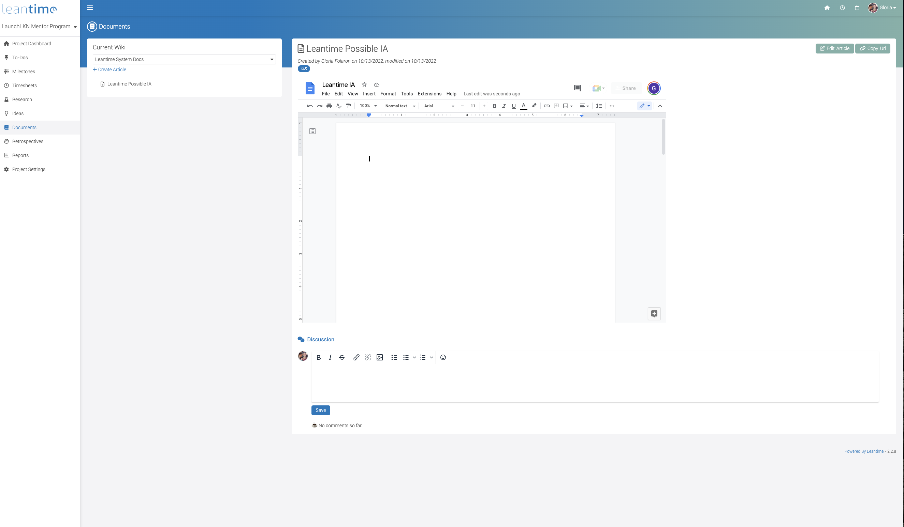             |      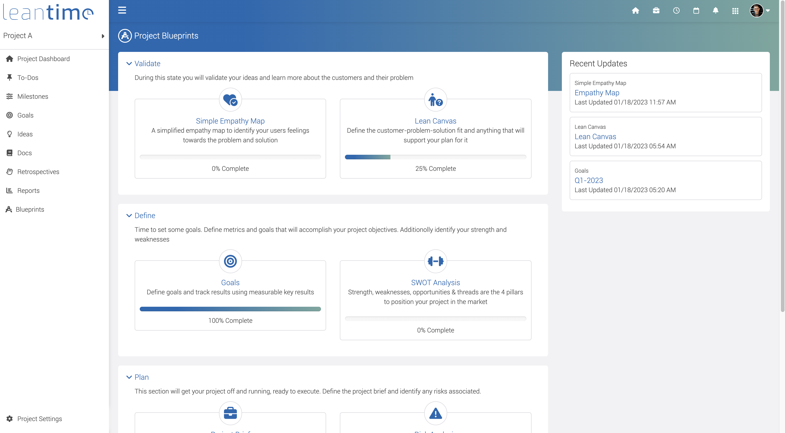       |        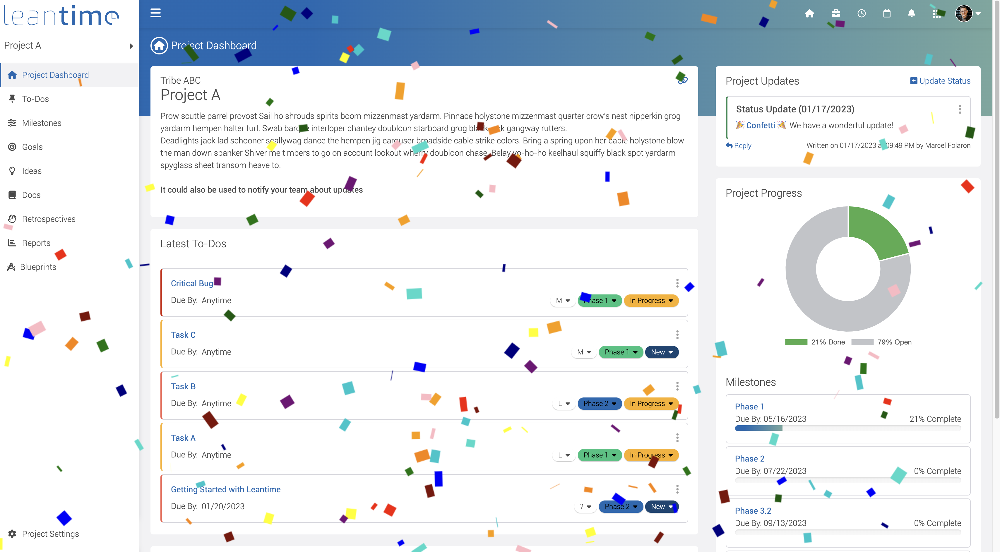        |
|       |       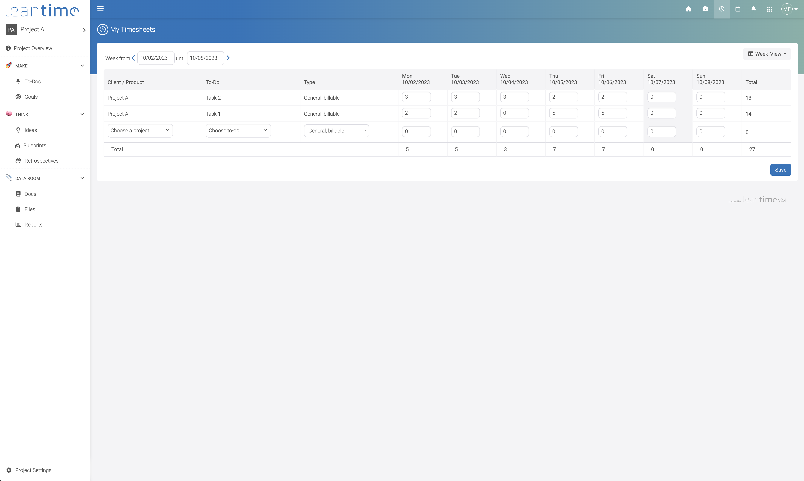       |        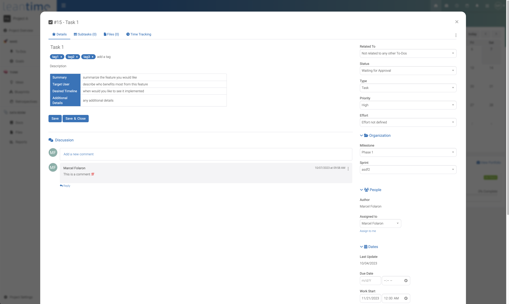        |

<br /><br />
### ❗System Requirements ###

* PHP 8.1+
* MySQL 5.7+
* Apache or Nginx (IIS works with some modifications)
* PHP Extensions: 
* * mysql, mbstring, GD, exif, pcntl, bcmath, opcache, ldap
<br /><br />
### ️⚡️ Installation (Production) ###

There are two main ways to install LeanTime for production. The first of which is to install all needed pieces of the system locally. The second is to use the offically supported Docker image.

#### Local Production Installation ####

* Download latest release package from our <a href="https://leantime.io/download-leantime/">Website</a> or <a href="https://github.com/Leantime/docker-leantime/releases">Github</a>
* Create an empty MySQL database
* Upload entire directory to your server 
* Point your domain root to the `public/` directory
* Rename `config/.env.sample` to `config/.env`
* Fill in your database credentials (username, password, host, dbname) in `config/.env`
* Navigate to `<yourdomain.com>/install`
* Follow instructions to install database and set up first user account

#### Production Installation via Docker ####

We maintain an official <a href="https://hub.docker.com/r/leantime/leantime">Docker image on dockerhub</a>. 
To run the image enter your MySQL credentials and execute. You can pass in all the configuration variables from .env

```
docker run -d --restart unless-stopped -p 80:80 --network leantime-net \
-e LEAN_DB_HOST=mysql_leantime \
-e LEAN_DB_USER=admin \
-e LEAN_DB_PASSWORD=321.qwerty \
-e LEAN_DB_DATABASE=leantime \
-e LEAN_EMAIL_RETURN=changeme@local.local \
--name leantime leantime/leantime:latest
```

Unless you have a database defined somewhere else you should use our [docker-compose file](https://github.com/Leantime/docker-leantime/blob/master/docker-compose.yml). 

Once started you can go to `<yourdomain.com>/install` and run the installation script.
<br /><br />
### 🤓 Installation (Development) ###

There are two ways to install a development setup of LeanTime. The first (but most techical) is to install all pieces of the system locally. The second (and prefered method) is to use a docker containerized development environment.

#### Local Development Installation ####

* Clone repository to your local server
* Create MySQL database
* Run wbepack builder via `make build-dev`
* Point your local domain to the `public/` directory
* Rename `config/.env.sample` to `config/.env`
* Fill in your database credentials (username, password, host, dbname) in `config/.env`
* Navigate to `<localdomain>/install`
* Follow instructions to install database and user account

#### Development Installation via Docker ####

For development, we use a dockerized development environment. You will need to have ``docker``, ``docker compose``, ``make``, ``composer``, ``git`` and ``npm`` installed.

* Notes for Windows Environments:
    - Run all commands within the git bash terminal in order to utilize unix specific commands
    - If installing php from a zip file, make sure to configure php.ini
    It does not exist initially, so copy C:\php\php.ini-development to C:\php\php.ini. You will also need to edit php.ini in a text editor and enable all needed extentions for the build process. You can find these by running the make commands and looking for any extensions that error out as missing. You can enable them by seaching php.ini for the extension that will look like: `;extension=gd` and removing the semicolon. 

In order to build the development docker image, in the root of this repository, run a primer with

```make clean build```

afterwards, run 

```make run-dev```

this will start the development server on port 8080.

The dev environment provides a mysql server, mail server, s3 server, and should be good to go for your needs out of the box. The configuration of the development environment is found in ``.dev/.env``, and is already seeded with the appropriate values. **You should probably not be modifying this unless you plan to work on a feature for a specific integration**. the applications you get are as follows

* [http://localhost:8080](http://localhost:8080) : leantime
* [http://localhost:8081](http://localhost:8081) : maildev - to check emails sent
* [http://localhost:8082](http://localhost:8082) : phpmyadmin(authentication ``leantime:leantime``) to check the DB schema and data
* [http://localhost:8083](http://localhost:8083) : s3ninja - to check s3 uploads. You need to enable this in the ``.dev/.env`` file by enabling s3

Additionally, XDebug is enabled, but you will have to modify your 
IDE key in the ``.dev/xdebug.ini`` file(or alternatively, on your IDE). You also need to have port 9003 temporarily open on your firewall so you can utilize it effectively. This is because connections from docker to the host will count as external inbound connection
<br /><br />
###  🏗 Update ###

#### Manual
* Make sure to take a backup of your database and files
* Replace all files in your directory with the updated version
* If there were any database changes, the system will redirect you to `<yourdomain.com>/update`

#### Script
* Execute ./updateLeantime.sh in the root of your leantime application

#### Docker
* Before updating, make sure your mysql container was started using a mounted volume, otherwise your content will be deleted
* Delete/Stop existing container
* Pull the latest docker image and rebuild using your compose file

## ☁️ Not interested in hosting yourself? Let us do it for you ##

We offer [managed hosting plans](https://leantime.io/managed-hosting/) as well as a [SaaS product](https://leantime.io/pricing/) so you can get all the benefits of Leantime without the hassle.
Head to [leantime.io](https://leantime.io/) for more information.
<br /><br />
## 🤙 Need technical support? ##

We can help you set up Leantime in your environment and customize it to your needs. Our support plans are [outlined on our website](https://leantime.io/priority-support/)

### Community Support ##

* Documentation [https://docs.leantime.io](https://docs.leantime.io)
* Community Chat [Discord](https://discord.gg/4zMzJtAq9z)
* File a bug report [https://github.com/Leantime/leantime/issues/new](https://github.com/Leantime/leantime/issues/new)
* Translations [https://crowdin.com/project/leantime](https://crowdin.com/project/leantime)
<br /><br />
## ⚖️ LICENSE Exceptions ##

Leantime is licensed under AGPLv3.
This file forms part of the Leantime Software for which the following exception is added: Plugins within the `/app/plugins` directory which may contain plugins licensed under other licenses including our enterprise license.

