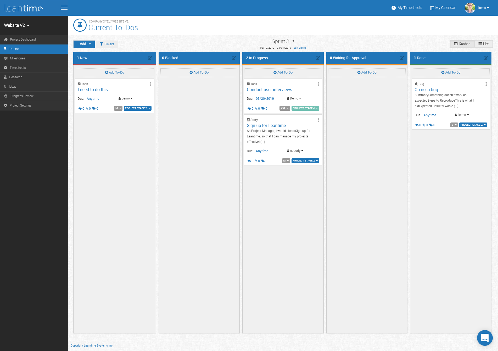
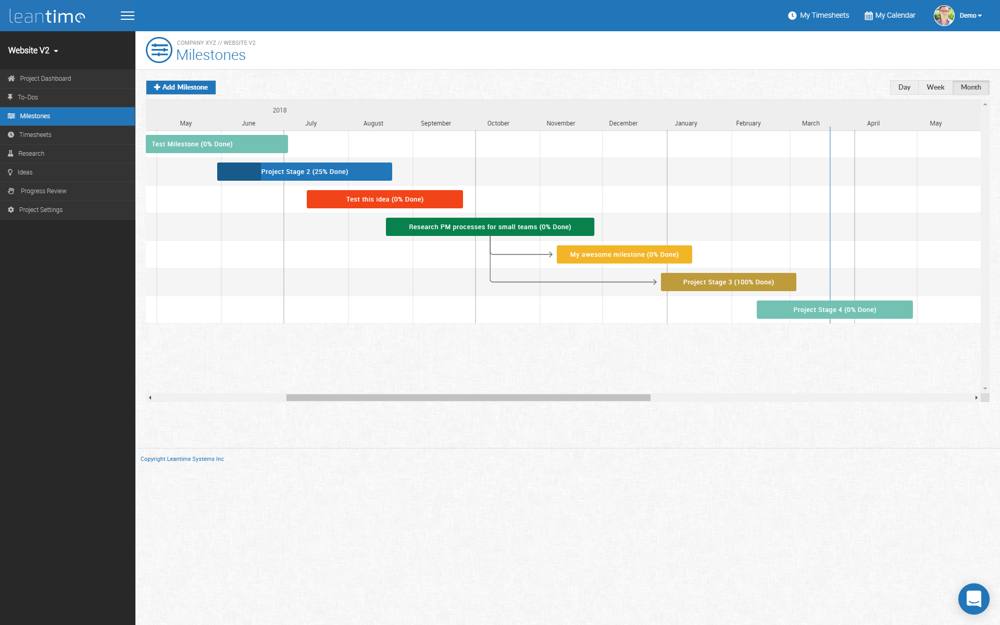

# Leantime #

Leantime is an open source project management system for small teams written in PHP, Javascript with MySQL. [https://leantime.io](https://leantime.io)
<br />
It offers
* Task Management using Kanban boards, list and calendar views
* Milestone management using Gantt charts
* Timesheet management
* Research boards for product development
* Idea boards
* Progress review reports






### Installation (Production) ###

* Download latest release package
* Create an empty MySQL database
* Upload entire directory to your server 
* Point your domain to the "public/" directory
* Rename config/configuration.sample.php to config/configuration.php
* Fill in your database credentials (username, password, host, dbname)
* Navigate to yourdomain.com/install
* Follow instructions to install database and set up first user account

### Installation (Development) ###

* Clone repository to your local server
* Create MySQL database
* Run composer to load php dependencies
```
composer install
```
then
```
npm install
```
to load Javascript dependencies and finally run the grunt task to create the compiled js files
```
grunt default
```
* Point your local domain to the "public/" directory
* Rename config/configuration.sample.php to config/configuration.php
* Fill in your database credentials (username, password, host, dbname)
* Navigate to localhost/install
* Follow instructions to install database and user account

### Learn More ###
Additional documentation can be found at [https://help.leantime.io](https://help.leantime.io)