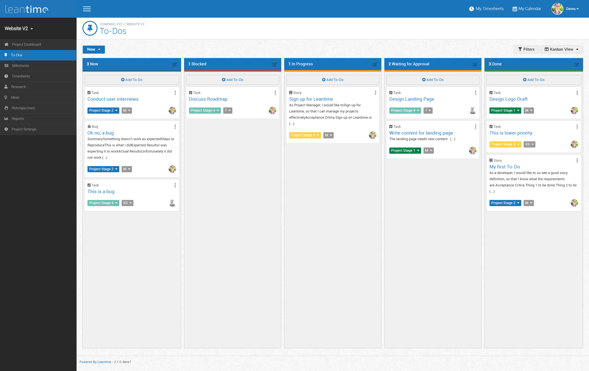
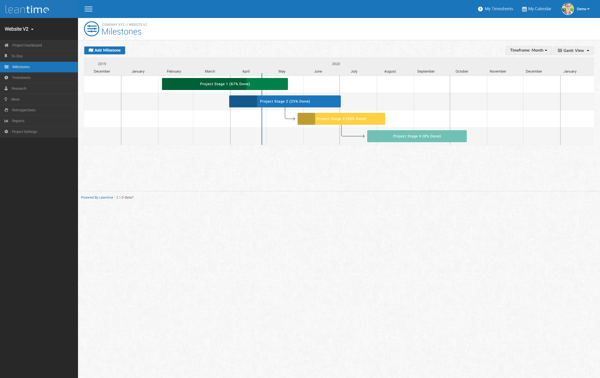
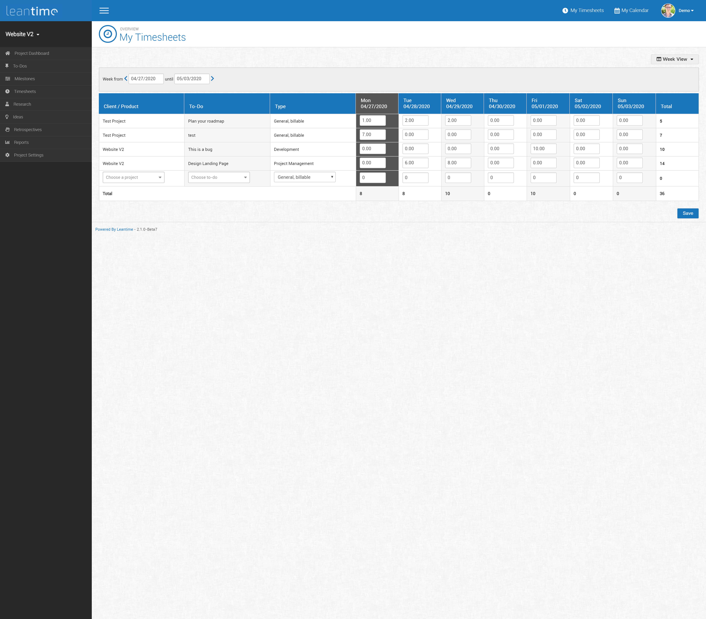
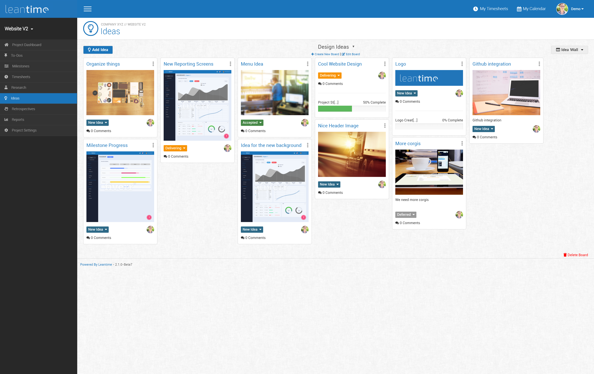
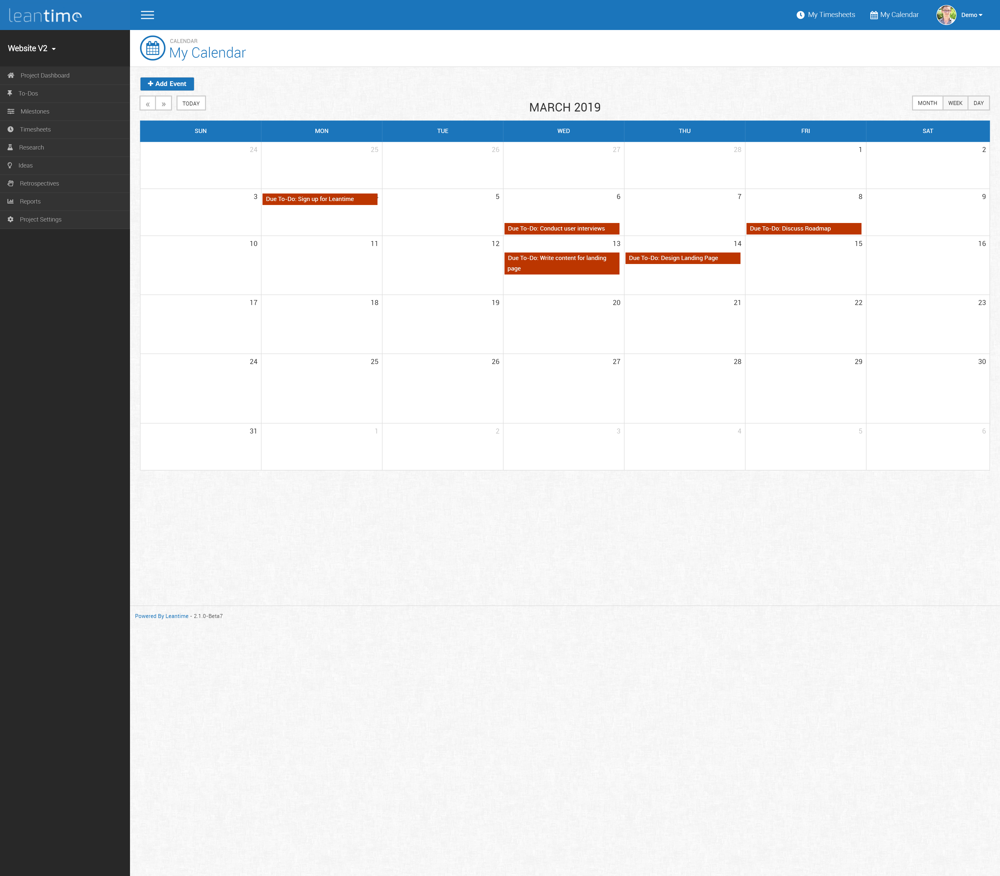

# Leantime #

Leantime is an open source project management system for small teams and startups written in PHP, Javascript with MySQL. [https://leantime.io](https://leantime.io)
<br /><br />
Features:
* Idea boards
* Research boards using the Lean Canvas
* Task management using Kanban boards, table and calendar views
* Milestone management using Gantt charts
* Timesheet management
* Retrospectives
* Project dashboards
* Multiple user roles (client, team member, client manager, manager, administrator)
* Integrations with Mattermost, Slack & Zulip
* Export timesheets, tasks and milestones to CSV
* File storage with AWS S3 or local file system 
* Project Reports
* Available in English, Spanish, Russian, Dutch
* Two Factor Authentication

### Screenshots ###

|         |   |  |
| ------------------------------------------------------------------------|:--------------------------------------------------------------------:| :--------------------------------------------------------------------: |
| |  |  |
|        |     |  |
|        |     | |  

### Installation (Production) ###

* Download latest release package
* Create an empty MySQL database
* Upload entire directory to your server 
* Point your domain to the `public/` directory
* Rename `config/configuration.sample.php` to `config/configuration.php`
* Fill in your database credentials (username, password, host, dbname) in `config/configuration.php`
* Navigate to `<yourdomain.com>/install`
* Follow instructions to install database and set up first user account

### Installation (Development) ###

* Install composer and npm
* Clone repository to your local server
* Create MySQL database
* Run composer to load php dependencies
```
composer install
```
then
```
npm install
```
to load Javascript dependencies and finally run the grunt task to create the compiled js files
```
./node_modules/grunt/bin/grunt Build-All
```
* Point your local domain to the `public/` directory
* Rename `config/configuration.sample.php` to `config/configuration.php`
* Fill in your database credentials (username, password, host, dbname) in `config/configuration.php`
* Navigate to `<localdomain>/install`
* Follow instructions to install database and user account

### Installation via Docker ###

We maintain an official <a href="https://hub.docker.com/r/leantime/leantime">Docker image on dockerhub</a>. 
To run the image enter your MySQL credentials and execute

```
docker run -d -p 80:80 --network leantime-net \
-e DB_HOST=mysql_leantime \
-e MYSQL_USER=admin \
-e MYSQL_PASSWORD=321.qwerty \
-e MYSQL_DATABASE=leantime \
--name leantime leantime/leantime:latest
```

Once started you can go to `<yourdomain.com>/install` and run the installation script.

### Update ###

* Make sure to take a backup of your database and files
* Replace all files in your directory with the updated version
* If there were any database changes, the system will redirect your to <yourdomain.com>/update

### Support ###
* Documentation [https://docs.leantime.io](https://docs.leantime.io)
* Community Forum [https://community.leantime.io](https://community.leantime.io)
* File a bug report [https://github.com/Leantime/leantime/issues/new](https://github.com/Leantime/leantime/issues/new)
* Contact Us [https://leantime.io/contact/](https://leantime.io/contact)
