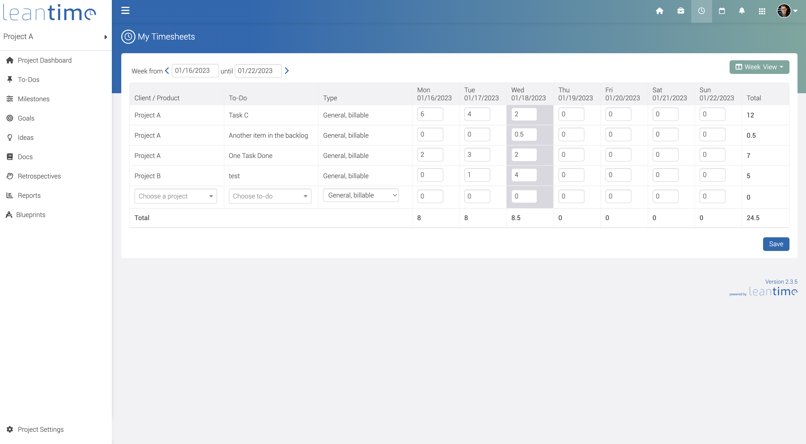

# Leantime #

Leantime is an open source project management system for small teams and startups written in PHP, Javascript with MySQL. [https://leantime.io](https://leantime.io)
<br /><br />
Features:
* Idea boards
* Research boards using the Lean Canvas
* Task management using Kanban boards, list and calendar views
* Milestone management using Gantt charts
* Timesheet management
* Retrospectives
* Project Overview dashboard
* Integrations with Mattermost & Slack

### Screenshots ###

|         |   |
| ------------------------------------------------------------------------|:--------------------------------------------------------------------:|
|  |       | 
|        |     |  

### Installation (Production) ###

* Download latest release package
* Create an empty MySQL database
* Upload entire directory to your server 
* Point your domain to the `public/` directory
* Rename `config/configuration.sample.php` to `config/configuration.php`
* Fill in your database credentials (username, password, host, dbname) in `config/configuration.php`
* Navigate to `<yourdomain.com>/install`
* Follow instructions to install database and set up first user account

### Installation (Development) ###

* Install composer and npm 
* Clone repository to your local server
* Create MySQL database
* Run composer to load php dependencies
```
composer install
```
then
```
npm install
```
to load Javascript dependencies and finally run the grunt task to create the compiled js files
```
grunt default
```
* Point your local domain to the `public/` directory
* Rename `config/configuration.sample.php` to `config/configuration.php`
* Fill in your database credentials (username, password, host, dbname) in `config/configuration.php`
* Navigate to `<localdomain>/install`
* Follow instructions to install database and user account

### Update ###

* Make sure to take a backup of your database and files
* Replace all files in your directory with the updated version
* If there were any database changes, the system will redirect your to <yourdomain.com>/update

### Learn More ###
For more information, check out: [https://help.leantime.io](https://help.leantime.io)
