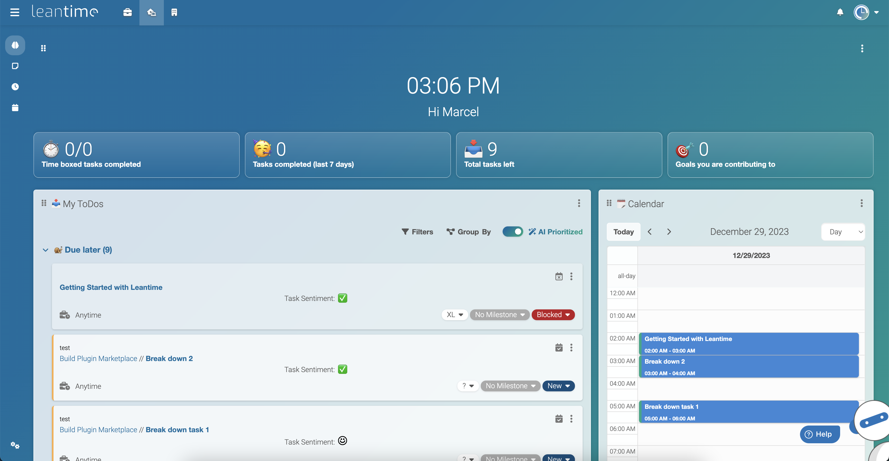

<div align="center">
<a href="https://leantime.io"></a>

### Leantime&reg; ###

Leantime is an open source project management system for non-project manager.<br />We combine strategy, planning and executing while making it easy for everyone on the team to use. Building with ADHD, dyslexia and Autistism in mind. <br />It's an alternative to ClickUp, Monday, or Asana. As simple as Trello but as feature-rich as Jira.<br />[https://leantime.io](https://leantime.io)<br />

<a href="https://trendshift.io/repositories/2264" target="_blank"></a>

[](https://www.gnu.org/licenses/agpl-3.0.en.html)
[](https://hub.docker.com/r/leantime/leantime)

[](https://discord.gg/4zMzJtAq9z)
[](https://crowdin.com/project/leantime)

<br />

  

</div>
<br /><br />

## 🚀 Features* ##
| Task Management                                                      | Project Planning                             | Information/Knowledge Management        | Administration                                  |
| -------------------------------------------------------------------- | -------------------------------------------- | --------------------------------------- |-------------------------------------------------|
| Task management via<br>kanban boards, gantt, table, list and calendar views | Project Dashboards, reports & status updates | Wikis / Docs                     | Easy installation                               |
| Unlimited subtasks and dependencies                                  | Goal & metrics tracking                      | Idea Boards                             | Multiple user roles and per project permissions |
| Milestone management                                                 | Lean & Business Model Canvas                 | Retrospectives                          | Two factor authentication                       |
| Sprint Management                                                    | SWOT Analysis canvas                         | File Storage via S3 or local filesystem | LDAP, OIDC integration                          |
| Timetracking & timesheets                                            | Risk Analysis                                | Screen & webcam recording               | Extendable via plugins and API                  |
|                                                                      | ... and more                                 | Comments/discussions on everything      | Integrates with Slack, Mattermost, Discord      |
|                                                                      | ... and more                                 |     | Available in over 20 languages                  |     
*yes, all of these features are included in the OSS version
<br /><br />
### 📸 Screenshots ###

|         |       |            |
|-------------------------------------------------------------------------|:------------------------------------------------------------------------------:|:----------------------------------------------------------------------------------:|
|  |  |       |
|          |         |             |

<br /><br />
### ❗System Requirements ###

* PHP 8.1+
* MySQL 8.0+
* Apache or Nginx (IIS works with some modifications)
* PHP Extensions: 
* * mysql, mbstring, GD, exif, pcntl, bcmath, opcache, ldap
<br /><br />
### ️⚡️ Installation (Production) ###

There are two main ways to install LeanTime for production. The first of which is to install all needed pieces of the system locally. The second is to use the officially supported Docker image.

#### Local Production Installation ####

* Download latest release package (file is called: Leantime-vx.x.x.zip) from the <a href="https://github.com/Leantime/docker-leantime/releases">release page</a>
* Create an empty MySQL database
* Upload the entire directory to your server 
* Point your domain root to the `public/` directory
* Rename `config/.env.sample` to `config/.env`
* Fill in your database credentials (username, password, host, dbname) in `config/.env`
* Navigate to `<yourdomain.com>/install`
* Follow instructions to install database and set up first user account

##### IIS Installation Notes #####

Whilst the steps above are applicable to Internet Information Services (IIS), there is an additional configuration change that may be required in IIS to ensure full functionality - you need to allow the PATCH method:

* Open IIS
* Expand the server and sites on the left and select the LeanTime site
* Double click on `Handler Mappings`
* Double click on the PHP handler mapping that is used by the site
* Click `Request Restrictions…`
* Click the `Verbs` tab
* In the `One of the following verbs` text box, add `,PATCH` - for example: `GET,HEAD,POST,PATCH`
* Click `OK`
* In the `Executable (optional)` text box, put a double quote character (`“`) at the start and at the end of the path to the `php-cgi.exe` file (_this isn't needed if the path doesn't have a space in it_)
* Click `OK`
* A popup will appear asking if you want to create a FastCGI application - click `Yes`

Note: You may need to repeat this when you upgrade PHP.

#### Production Installation via Docker ####

We maintain an official <a href="https://hub.docker.com/r/leantime/leantime">Docker image on dockerhub</a>. 
To run the image enter your MySQL credentials and execute. You can pass in all the configuration variables from .env

```
docker run -d --restart unless-stopped -p 80:80 --network leantime-net \
-e LEAN_DB_HOST=mysql_leantime \
-e LEAN_DB_USER=admin \
-e LEAN_DB_PASSWORD=321.qwerty \
-e LEAN_DB_DATABASE=leantime \
-e LEAN_EMAIL_RETURN=changeme@local.local \
--name leantime leantime/leantime:latest
```

Unless you have a database defined somewhere else you should use our [docker-compose file](https://github.com/Leantime/docker-leantime/blob/master/docker-compose.yml). 

Once started you can go to `<yourdomain.com>/install` and run the installation script.

**Important: If you are planning to use plugins you need to mount the plugin folder `plugins:/var/www/html/app/Plugins` and ensure the www-data user has access to it. Otherwise installation may fail or plugins will be removed after a restart**

##### Docker Installation Notes #####

If you intend to place Leantime behind a reverse proxy (nginx, etc.) to handle custom domain name resolution and SSL offloading, you will need to set the following environment variable in docker
```
-e LEAN_APP_URL=https://yourdomain.com \
```
* Update yourdomain.com to your custom domain name.
<br /><br />
### 🤓 Installation (Development) ###

There are two ways to install a development setup of LeanTime. The first (but most technical) is to install all pieces of the system locally. The second (and preferred method) is to use a docker containerized development environment.

#### Local Development Installation ####

* Clone repository to your local server
* Create MySQL database
* Run webpack builder via `make build-dev`
* Point your local domain to the `public/` directory
* Rename `config/.env.sample` to `config/.env`
* Fill in your database credentials (username, password, host, dbname) in `config/.env`
* Navigate to `<localdomain>/install`
* Follow instructions to install database and user account

#### Development Installation via Docker ####

For development, we use a dockerized development environment. You will need to have ``docker``, ``docker compose``, ``make``, ``composer``, ``git`` and ``npm`` installed.

* Notes for Windows Environments:
    - Run all commands within the git bash terminal in order to utilize unix specific commands
    - If installing php from a zip file, make sure to configure php.ini
    It does not exist initially, so copy C:\php\php.ini-development to C:\php\php.ini. You will also need to edit php.ini in a text editor and enable all needed extensions for the build process. You can find these by running the make commands and looking for any extensions that error out as missing. You can enable them by searching php.ini for the extension that will look like: `;extension=gd` and removing the semicolon. 

In order to build the development docker image, in the root of this repository, run a primer with

```make clean build```

afterwards, run 

```make run-dev```

this will start the development server on port 8090.

The dev environment provides a MySQL server, mail server, s3 server, and should be good to go for your needs out of the box. The configuration of the development environment is found in ``.dev/.env``, and is already seeded with the appropriate values. **You should probably not be modifying this unless you plan to work on a feature for a specific integration**. the applications you get are as follows

* [http://localhost:8090](http://localhost:8090) : leantime
* [http://localhost:8081](http://localhost:8081) : maildev - to check emails sent
* [http://localhost:8082](http://localhost:8082) : phpMyAdmin(authentication ``leantime:leantime``) to check the DB schema and data
* [http://localhost:8083](http://localhost:8083) : s3ninja - to check s3 uploads. You need to enable this in the ``.dev/.env`` file by enabling s3

Additionally, Xdebug is enabled, but you will have to modify your 
IDE key in the ``.dev/xdebug.ini`` file(or alternatively, on your IDE). You also need to have port 9003 temporarily open on your firewall so you can utilize it effectively. This is because connections from docker to the host will count as external inbound connections
<br /><br />
###  🏗 Update ###

#### Manual
* Make sure to take a backup of your database and files
* Replace all files in your directory with the updated version
* If there were any database changes, the system will redirect you to `<yourdomain.com>/update`

#### CLI
* Run `bin/leantime system:update` 

#### Docker
* Before updating, make sure your mysql container was started using a mounted volume, otherwise your content will be deleted
* Delete/Stop existing container
* Pull the latest docker image and rebuild using your compose file 

## ☁️ Not interested in hosting yourself? Let us do it for you ##

We offer [managed hosting plans](https://leantime.io/managed-hosting/) as well as a [SaaS product](https://leantime.io/pricing/) so you can get all the benefits of Leantime without the hassle.
Head to [leantime.io](https://leantime.io/) for more information.
<br /><br />
## 🤙 Need technical support? ##

We can help you set up Leantime in your environment and customize it to your needs. Our support plans are [outlined on our website](https://leantime.io/priority-support/).

## Contributing

We're excited you are interested in contributing to Leantime. We want to make sure you have a great experience contributing to Leantime and that the new features you build will make it into core. 
<br />

### Bugs

Find an issue on Github (or create a new one) add your name to it or comment that you will be working on it. Once fixed, create a  Pull Request.

### New Features in Core

If you have an idea about new features please reach out to us on Discord. This is where we coordinate feature development and discuss whether core is the right place to add your new features (Plugins is the alternative). 

### Translations

We use (Crowdin)[https://crowdin.com/project/leantime](https://crowdin.com/project/leantime) to manage all of our translations. If you don't see a language please message us on Discord. 


### Community Support ##

* Documentation [https://docs.leantime.io](https://docs.leantime.io)
* Community Chat [Discord](https://discord.gg/4zMzJtAq9z)
* File a bug report [https://github.com/Leantime/leantime/issues/new](https://github.com/Leantime/leantime/issues/new)
* Translations [https://crowdin.com/project/leantime](https://crowdin.com/project/leantime)
<br /><br />
## ⚖️ LICENSE Exceptions ##

Leantime is licensed under AGPLv3.
This file forms part of the Leantime Software for which the following exception is added: Plugins within the `/app/plugins` directory which may contain plugins licensed under other licenses including our enterprise license.


