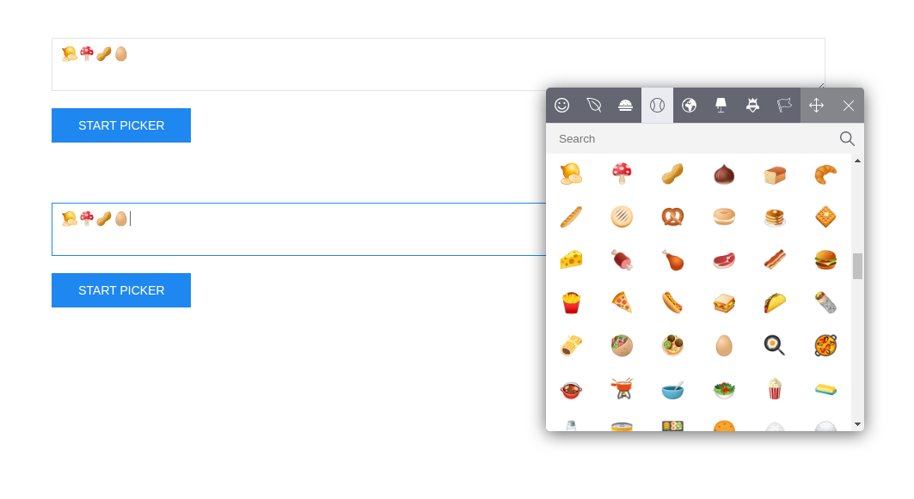

# FG Emoji Picker - Emoji picker created with vanilla javascript
This is the simplest to use emoji picker built with vanilla javascript.



## Benefits:

- It is only one .js file without css or other files
- There is no jQuery or other libraries
- Simplicity of usage
- Multiple textareas and triggers
- Draggable emoji picker container

## Initialize

Initialze plugin with ```new EmojiPicker({});```

## Options

- Trigger - must be an array of objects. Inside object there are two properties. First is selector, and second - **insertInto** method to define where emoji going to be inserted. If there are multiple 'textarea's - you can provide array of selectors as well. Watch example below.
- Close button - **closeButton** method can be true of false depending on whether you want close button on emoji picker or not.
- specialButtons - takes color code to change special (move and close) button colors.

```
new EmojiPicker({
    trigger: [
        {
            selector: '.first-btn',
            insertInto: ['.one', '.two'] // If there is only one '.selector', than it can be used without array
        },
        {
            selector: '.second-btn',
            insertInto: '.two'
        }
    ],
    closeButton: true,
    specialButtons: 'green' // #008000, rgba(0, 128, 0);
});
```
